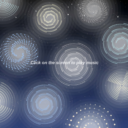

# viki_zliu0454_9103_Major project

## Instructions for Interacting with the Work
  
I chose an interactive approach that uses the volume and frequency information of audio to dynamically display animation effects. By clicking the screen, music playback is initiated, and as the rhythm progresses, the visuals change in real-time according to the audio's volume and frequency, syncing perfectly with the music. Clicking again will pause both the music and animation. There will also be a prompt on the screen to guide users to easily control the interaction between music and animation with a simple tap, creating an immersive experience that blends sight and sound.

In this way, the piece is not just a visual presentation but also a visualization of the music. Every note transforms into a flowing image, creating a unique artistic atmosphere, allowing music to be not only heard but also seen, delivering a more creative artistic experience.

